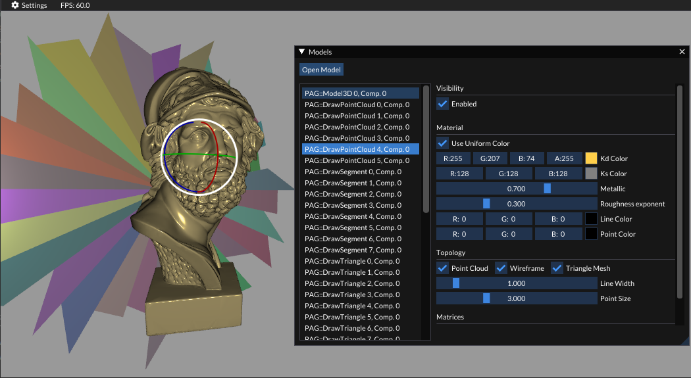

 
 
 

# Algoritmos Geométricos (2022-2023)

Proyecto template para la asignatura de Algoritmos Geométricos en la Universidad de Jaén. A continuación se describe la interacción con la aplicación.

1. Cámara: interacción a través de teclado y ratón.
    | Movimiento | Interacción |
    | ----------- | ----------- |
    | Forward | Botón derecho + <kbd>W</kbd> |
    | Backwards | Botón derecho + <kbd>S</kbd> |
    | Left | Botón derecho + <kbd>A</kbd> |
    | Backwards | Botón derecho + <kbd>D</kbd> |
    | Zoom | Rueda de ratón |
    | Órbita horizontal | <kbd>X</kbd> |
    | Órbita vertical | <kbd>Y</kbd> |
    | Giro de cámara | Botón izquierdo de ratón |
    | Reiniciar cámara | <kbd>B</kbd> |

2. Guizmos: interacción con modelos para llevar a cabo operaciones de traslación, rotación y escalado. Para ello es necesario abrir el menú `Settings` > `Models` y seleccionar un modelo.
    | Operación | Interacción |
    | ----------- | ----------- |
    | Traslación de modelo | <kbd>T</kbd> |
    | Rotación de modelo | <kbd>R</kbd> |
    | Escalado de modelo | <kbd>S</kbd> |

     
    <em>Transformación de modelo mediante la interfaz. En este caso se muestra una rotación.</em>

3. Visualización de diferentes topologías, habiéndose generado estas durante la carga de los modelos y encontrándose en el vector de modelos de la escena (`SceneContent`, aunque debe gestionarse desde el `Renderer`).
    | Operación | Interacción |
    | ----------- | ----------- |
    | Activar/Desactivar nube de puntos | <kbd>0</kbd> |
    | Activar/Desactivar malla de alambre | <kbd>1</kbd> |
    | Activar/Desactivar malla de triángulos | <kbd>2</kbd> |

     
    <em>Nube de puntos, malla de alambre y malla de triángulos visualizadas sobre el mismo modelo.</em>

4. Captura de pantalla con antialiasing (para la documentación `:D`).

Desde la interfaz se ofrecen otras tantas funcionalidades:

1. `Settings` > `Rendering`: 
    - Modificación de topologías visibles, como en el punto 3 de la lista previa. 
    - Modificación de color de fondo.
2. `Settings` > `Camera`:
    - Modificación de propiedades de la cámara y tipo de proyección.
3. `Settings` > `Lights`: 
    - Modificación de una única luz puntual (colores y posición en el espacio). 
4. `Settings` > `Models`:
    - Modificación de transformación de modelo.
    - Modificación de material (puntos, líneas y triángulos).
    - Modificación de tamaño y anchura de puntos y líneas, respectivamente. 
    - Carga de mallas de triángulos (`.obj`, `.gltf` y `.fbx`).

## Integración de nuevos modelos renderizables

El nuevo modelo deberá implementarse como una subclase de `Model3D`, la cual nos dará todas las funcionalidades necesarias para cargar la geometría y topología en GPU. Nos desentendemos de esta tarea, y por tanto, nuestra única labor es definir geometría y topología. 

Se debe tener en cuenta que los atributos de un vértice (`VAO::Vertex`) son (por orden): posición (`vec3`), normal (`vec3`) y coordenadas de textura (`vec2`).
Así, podemos añadir nuevos vértices a nuestro modelo mediante la siguiente sintaxis:

    componente->_vertices.insert(component->vertices.end(), { vertices })

donde vertices puede definirse como sigue:

    {   
        VAO::Vertex { vec3(x, y, z), vec3(nx, ny, nz) },
        VAO::Vertex { vec3(x, y, z) },
        VAO::Vertex { vec3(x, y, z), vec3(nx, ny, nz), vec2(u, v) }
    }

El orden es importante, pero podemos omitir aquellos atributos que desconocemos.

Respecto a la topología, tendremos disponibles tres vectores (nube de puntos, malla de alambre, y malla de triángulos) en la variable `component->_indices`. De nuevo, podemos insertar primitivas como se muestra a continuación:

- Triángulos: 
    
        componente->_indices[VAO::IBO_TRIANGLES].insert(
            componente->_indices[VAO::IBO_TRIANGLES].end(), 
            { 
                0, 1, 2, RESTART_PRIMITIVE_INDEX,
                1, 2, 3, RESTART_PRIMITIVE_INDEX,
                ...
            })

- Líneas: 
    
        componente->_indices[VAO::IBO_TRIANGLES].insert(
            componente->_indices[VAO::IBO_TRIANGLES].end(), 
            { 
                0, 1, RESTART_PRIMITIVE_INDEX,
                1, 2, RESTART_PRIMITIVE_INDEX,
                ...
            })

- Puntos: 
    
        componente->_indices[VAO::IBO_TRIANGLES].insert(
            componente->_indices[VAO::IBO_TRIANGLES].end(), 
            { 
                0, 1, 2, 3, 4
                ...
            })
    
    **Nota**: dado un número de vértices `n`, podemos generar un vector como { 0, 1, 2, ..., n-1 } mediante `std::iota(begin, end, 0)` tras `vector.resize(n)`.